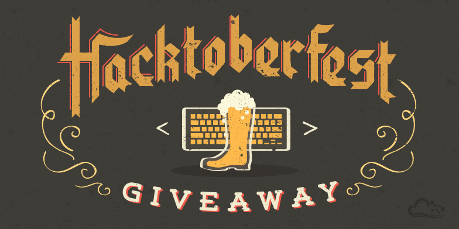
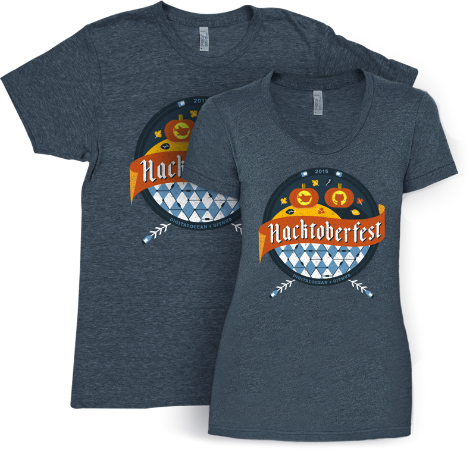
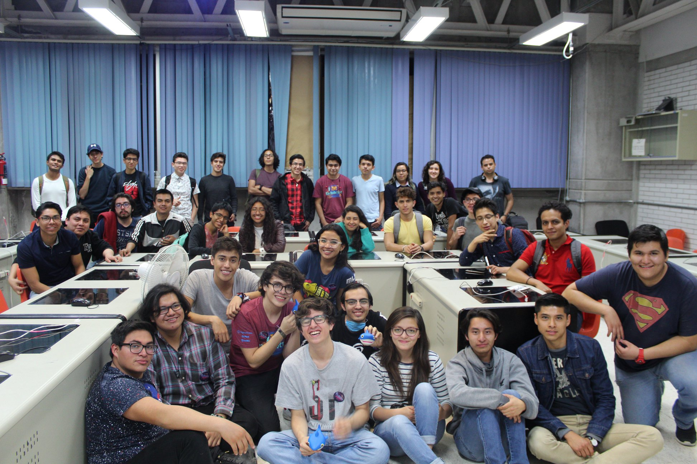
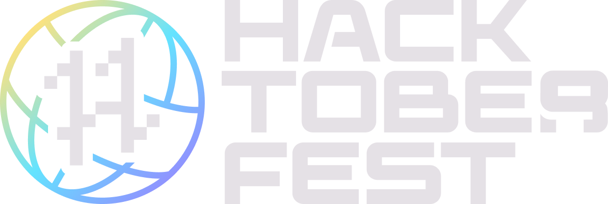
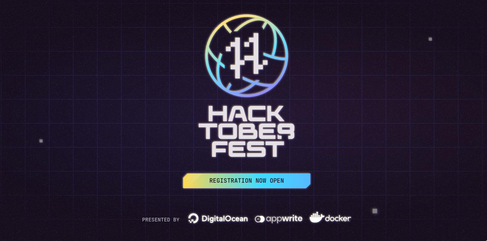
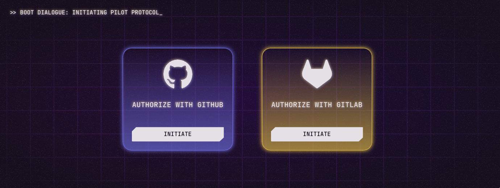
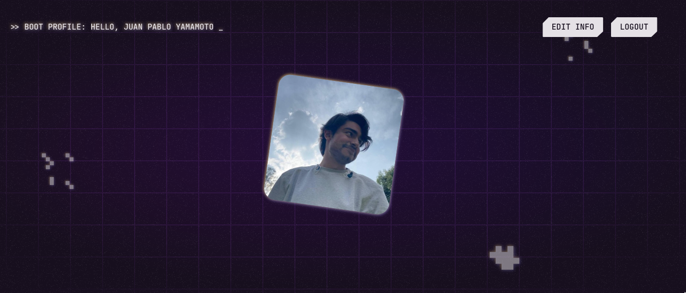

<link rel="stylesheet" href="./_assets/theme/custom.css" id="theme" />

<!-- .slide: data-background="./assets/banner.png" -->

<!--s-->

# ¿Qué es Hacktoberfest?

Durante el mes de octubre, celebramos los proyectos de código abierto, y a la comunidad entera de gente que contribuye.

<!--s-->

# ¿Cómo comenzó todo?

<!--s-->

## 2014

<!--s-->

## 2015

<!--s-->

## 2016

<!--s-->

## 2017

<!--s-->

## 2018

<!--s-->

## 2019

<!--s-->

## 2020

<!--s-->

## 2021

<!--s-->

## 2022

<!--s-->

## Más que un evento, progreso tecnológico...

<!--s-->

## En 2021

- 46,676 usuarios
<!-- .element: class="fragment" data-fragment-index="2" -->

- 146 países
<!-- .element: class="fragment" data-fragment-index="3" -->

- 294,451 _pull requests_
<!-- .element: class="fragment" data-fragment-index="4" -->

- 348 lenguajes de programación
<!-- .element: class="fragment" data-fragment-index="5" -->

<!--s-->

## Más que un evento, una comunidad...

<!--s-->

- [GitHub #hacktoberfest](https://github.com/topics/hacktoberfest)
<!-- .element: class="fragment" data-fragment-index="1" -->
- [Reddit (r/hacktoberfest)](https://www.reddit.com/r/hacktoberfest/)
<!-- .element: class="fragment" data-fragment-index="2" -->
- [Twitter (@hacktoberfest)](https://twitter.com/hacktoberfest)
<!-- .element: class="fragment" data-fragment-index="3" -->
- [Discord (discord.gg/hacktoberfest)](https://discord.com/invite/hacktoberfest)
<!-- .element: class="fragment" data-fragment-index="4" -->

<!--s-->

# ¿Cómo participo?

- Contribuye durante el mes de octubre
<!-- .element: class="fragment" data-fragment-index="1" -->

- Realiza 4 _pull requests_ aceptados en proyectos de código abierto en GitHub o GitLab
<!-- .element: class="fragment" data-fragment-index="2" -->

- Verifica que los repositorios tengan la etiqueta `hacktoberfest` o que tu contribución tenga `hacktoberfest-accepted`
<!-- .element: class="fragment" data-fragment-index="3" -->

<!--s-->

# Premios

- Un árbol plantado en tu nombre o una playera edición especial de Hacktoberfest 2022
<!-- .element: class="fragment" data-fragment-index="1" -->
- SWAG!
<!-- .element: class="fragment" data-fragment-index="2" -->

<!--s-->

# ¿Necesito programar?

## ¡NO!
<!-- .element: class="fragment" data-fragment-index="1" -->

<!--s-->

# Contribuciones de código

Todos los lenguajes

<!--s-->

# Contribuciones low-code

- Documentación
- Pruebas

<!--s-->

# Contribuciones non-code

- Traducciones
- Ediciones
- Pruebas de experiencia de usuario
- Diseño gráfico
- Producción de video

<!--s-->

# ¿Cómo me inscribo?

[https://hacktoberfest.com/](https://hacktoberfest.com/)

<!--s-->

<!--s-->

<!--s-->

<!--s-->

# ¡Comienza a contribuir!

<!--s-->

# `> whoami`
 

 
GitHub Campus Expert 🚩
 
[@jpyamamoto](https://github.com/jpyamamoto) en **GitHub**
